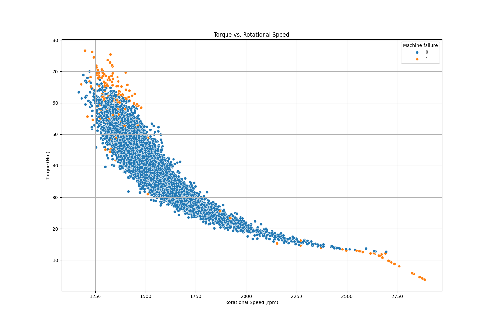
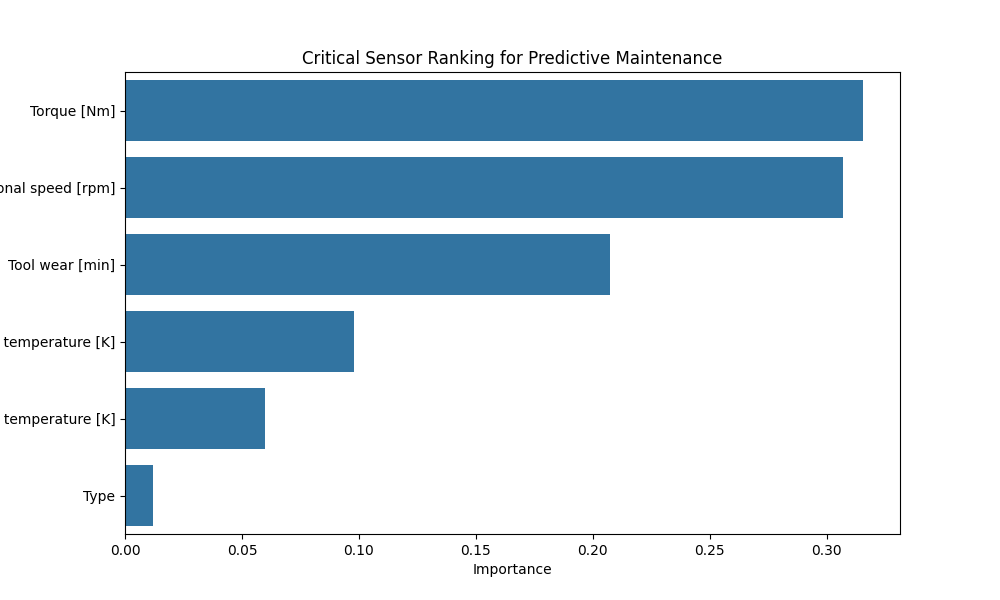

# Predictive Maintenance for Industrial Automation
*Applying Data Science and Machine Learning to reduce downtime in smart manufacturing.*

## Project Overview
This project utilizes the **AI4I 2020 Predictive Maintenance Dataset** to identify and predict mechanical failure patterns in production environments. As a Global Production Engineering (GPE) student, I focused on bridging the gap between raw sensor data and actionable maintenance insights.

## Phase 1 & 2: Root Cause Analysis (RCA)
I analyzed 10,000 rows of sensor data to determine which factors actually drive machine failure.

### Key Engineering Insights:
*   **The Thermal Myth:** Analysis showed only a **0.3K difference** in process temperature between healthy and failed machines. Thermal stress is a secondary factor in this specific dataset.
*   **The Mechanical Driver:** Failed machines exhibited a **26% higher average torque** (50.16 Nm) compared to healthy ones (39.63 Nm), often accompanied by a drop in rotational speed.
*   **Failure Fingerprint:** As shown below, failures are concentrated in the high-torque/low-speed and extreme high-speed regions.

## Phase 3 & 4: Machine Learning & Optimization
I developed a predictive model to classify potential failures before they occur.

### Model Evolution:
1.  **Baseline (Decision Tree):** Established a transparent "if-then" logic for engineers to follow.
2.  **Ensemble (Random Forest):** Used 200 trees to improve robustness and reduce false alarms.
3.  **Hyperparameter Tuning:** Performed **GridSearchCV** with 5-fold cross-validation to maximize the **F1-Score**, balancing technician workload (Precision) with machine safety (Recall).

### Final Model Performance:
*   **Precision:** 0.65 (2 out of 3 alarms are actionable)
*   **Recall:** 0.59 (Captures 60% of potential failures)
*   **Accuracy:** 98% (Note: Accuracy is misleading due to class imbalance)

### Critical Sensor Ranking:
According to the model's feature importance analysis, **Torque** and **Rotational Speed** are the most critical predictors of machine health.

## Tech Stack
*   **Language:** Python 3.13.5
*   **Libraries:** Pandas, Matplotlib, Seaborn, Scikit-Learn
*   **Techniques:** GridSearchCV, Random Forest Ensembles, Ordinal Encoding, Feature Importance Analysis.

## Technical Considerations & Future Work
*   **Scaling:** Feature scaling was omitted as tree-based ensembles are scale-invariant.
*   **Bagging:** Random Forest was chosen for its inherent bagging properties to prevent overfitting.
*   **Next Steps:** Future iterations will explore **Gradient Boosting (XGBoost)** and **Threshold Tuning** to further improve the Recall-Precision trade-off for critical failure modes.
